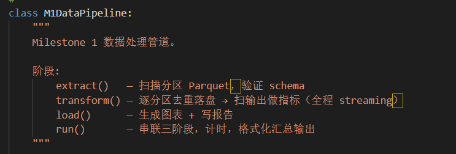
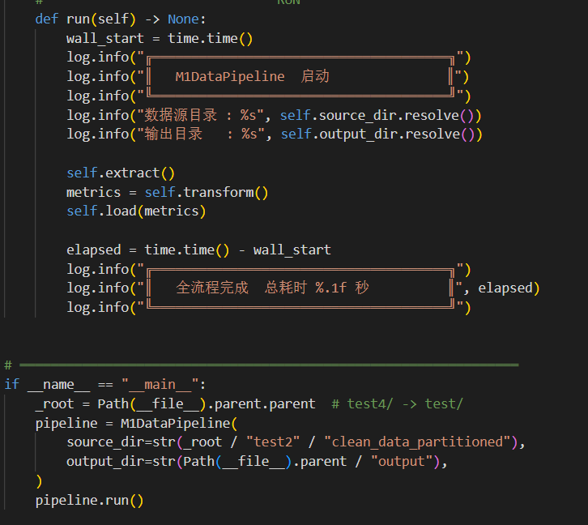
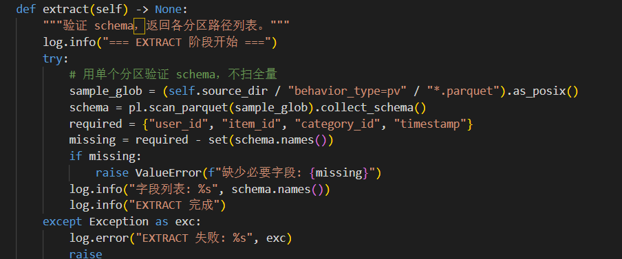
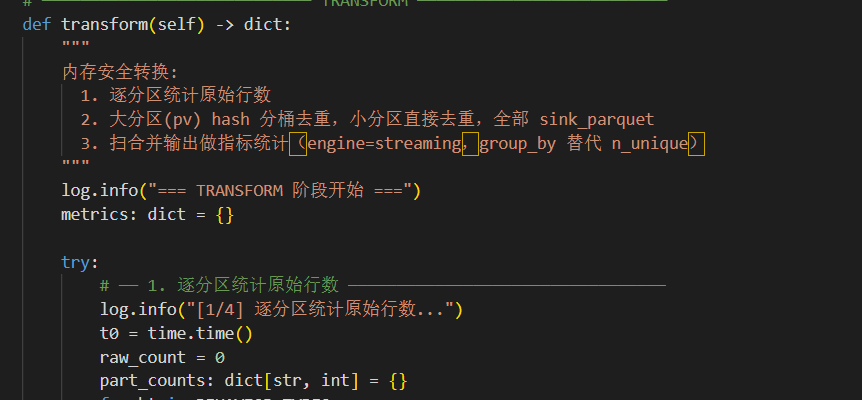
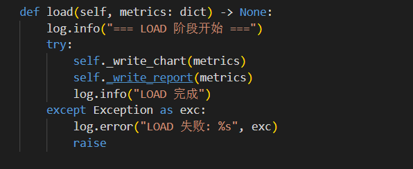
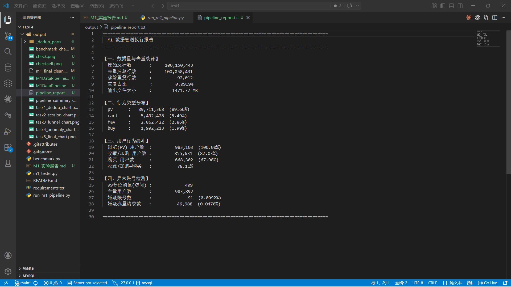
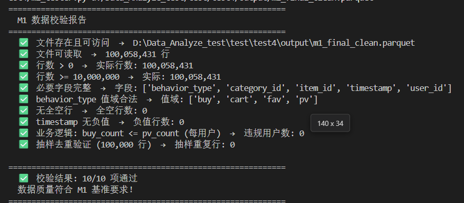
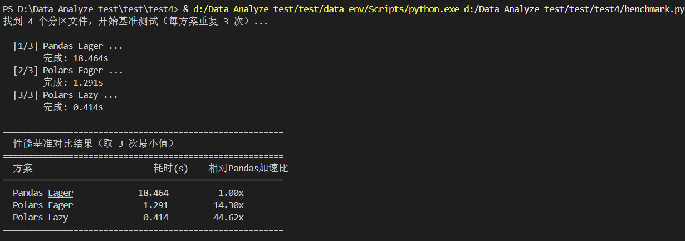

# 实验四 Milestone 1（M1）实验报告

## 一、实验目的

本次实验围绕 Milestone 1（M1）“数据清洗与 ELT 工程化交付”展开，目标是在前三周完成数据提取、清洗、聚合与漏斗分析的基础上，将原本偏脚本化的实现重构为可交付、可复现、可审计的工程化数据管道。具体目标如下：

1. 将分散在多个实验阶段中的数据处理逻辑模块化封装，形成标准的 `M1DataPipeline` 类。
2. 使用 Polars、DuckDB、Parquet 等现代工具完成亿级日志数据的高效处理，提升数据工程实践能力。
3. 借助 AI 辅助完成代码重构、代码审计与文档整理，提升程序的可维护性与工程化程度。
4. 通过 `benchmark.py` 对比 Pandas、Polars Eager、Polars Lazy 的性能差异，建立性能基准意识。
5. 通过 `m1_tester.py` 完成数据黑盒测试，验证最终交付文件 `m1_final_clean.parquet` 的字段完整性与业务正确性。
6. 编写完整实验报告，为后续 Milestone 2（M2）流批一体数据管道设计打下基础。

---

## 二、实验环境

### 2.1 运行环境

| 项目 | 环境 |
|------|------|
| 操作系统 / 终端 | Windows + PowerShell |
| Python 版本 | 3.14.0 |
| 项目目录 | `D:\Data_Analyze_test\test\test4` |
| Python 解释器 | `d:/Data_Analyze_test/test/data_env/Scripts/python.exe` |

### 2.2 主要依赖

| 依赖库 | 版本 |
|--------|------|
| Polars | 1.38.1 |
| DuckDB | 1.5.0 |
| Pandas | 3.0.1 |
| PyArrow | 23.0.1 |
| Matplotlib | 3.10.8 |

### 2.3 核心文件

| 文件 | 作用 |
|------|------|
| `run_m1_pipeline.py` | M1 主程序，封装 `M1DataPipeline`，支持一键运行 |
| `benchmark.py` | 性能基准测试脚本 |
| `m1_tester.py` | 黑盒校验脚本 |
| `README.md` | 技术说明文档 |
| `output/m1_final_clean.parquet` | 最终交付数据文件 |
| `output/pipeline_summary_chart.png` | 管道分析汇总图 |
| `output/benchmark_chart.png` | 性能对比图 |

---

## 三、实验步骤

### 3.1 主程序工程化重构

根据实验要求，将前序实验中的清洗、去重、分析和输出逻辑统一封装到 `M1DataPipeline` 类中。主程序采用标准 ELT 三阶段结构：

- `extract()`：扫描分区 Parquet 文件并验证字段结构。
- `transform()`：完成逐分区统计、精密去重、漏斗分析、异常账号识别等核心计算。
- `load()`：输出图表和文本报告。
- `run()`：作为统一入口，串联全流程并记录日志。

同时在实现中加入了以下工程化特性：

- 使用 `logging` 统一输出阶段日志；
- 使用 `try-except` 捕获异常并中断流程；
- 使用 `Path` 管理路径，减少字符串路径拼接；
- 使用 `streaming collect`、`sink_parquet()` 和分桶去重来降低内存压力。

### 3.2 数据处理流程执行

主程序默认读取上级目录 `test2/clean_data_partitioned/` 下按 `behavior_type` 分区的 Parquet 文件，并将结果输出到 `output/` 目录。主要处理步骤如下：

1. 扫描分区数据并校验字段。
2. 对 `pv` 大分区采用 “按 `user_id` 哈希分 16 桶 + 逐桶 streaming 去重” 的两步方案。
3. 对 `buy`、`cart`、`fav` 等小分区直接进行 streaming 去重。
4. 合并所有去重结果，生成 `m1_final_clean.parquet`。
5. 基于最终输出文件计算行为分布、漏斗转化、异常账号等指标。
6. 输出图表、文本报告和性能对比结果。

### 3.3 AI 辅助代码审计

本次审计主要围绕以下几个维度展开：

1. **结构设计审计**：检查代码是否采用清晰的阶段划分，是否存在“主流程过长、职责混杂、难以维护”的问题。审计结果表明，程序采用了较规范的 `extract()`、`transform()`、`load()`、`run()` 四段式组织结构，主流程可读性较好，符合 ELT 管道的工程化表达方式。
2. **健壮性审计**：检查关键阶段是否具有异常捕获、日志记录和失败中断机制。代码在 `extract`、`transform`、`load` 三个阶段均设置了 `try-except`，并通过 `logging` 输出运行状态，便于定位错误来源，这一点明显优于普通实验脚本。
3. **路径与部署审计**：检查程序是否依赖固定目录布局。审计发现，`__main__` 中直接通过 `Path(__file__).parent.parent / "test2" / "clean_data_partitioned"` 构造输入路径，这虽然在当前实验目录下运行稳定，但迁移到其他机器或其他项目结构时仍然依赖相同目录层级，说明其可移植性还有提升空间。
4. **数据正确性审计**：检查去重规则、字段校验和业务规则过滤是否存在隐患。例如在 `extract()` 中，程序通过 `behavior_type=pv` 分区样本执行 `collect_schema()` 来验证字段结构，这种方式成本较低，但本质上属于“抽样校验”，如果其他分区字段异常而样本分区正常，理论上仍可能漏检。又如去重阶段使用 `group_by(...).agg(pl.first("category_id"))` 代替 `unique()`，能够兼容 streaming，但当同一主键对应多种 `category_id` 时，程序会保留第一条记录，这一策略在当前数据集上是可接受的，但从审计角度看应当被明确记录。
5. **性能与资源审计**：检查是否存在明显的内存风险。代码中使用了 `Polars Lazy API`、`engine="streaming"`、`sink_parquet()`、按 `user_id` 哈希分 16 桶等策略，说明作者对亿级数据处理中的内存瓶颈有较强意识；这一点也是本项目工程化价值最突出的部分之一。

通过 AI 辅助审计，当前程序的主要优点可以概括为：

- ELT 分层清晰，主流程职责明确，便于演示、维护和后续扩展；
- `Path`、`logging`、阶段化方法、图表输出等设计使代码具备了较好的工程化交付形态；
- 在大规模数据场景下主动采用 streaming 和分桶去重，能够有效降低内存压力；
- 对关键业务规则增加了 `buy_count <= pv_count` 的过滤逻辑，使最终交付文件更符合业务约束。

与此同时，审计也识别出几个值得在报告中明确记录的改进点：

- **路径配置仍偏硬编码**：当前数据源路径依赖固定相对目录，建议后续改为命令行参数、配置文件或环境变量注入，增强程序的跨目录部署能力。
- **Schema 校验仍可加强**：目前仅对单个 `pv` 分区做字段验证，建议扩展为对所有行为分区逐一校验，避免局部样本正常但全量分区不一致的情况。
- **去重保留策略应显式说明**：当前使用 `pl.first("category_id")` 作为重复记录保留值，虽然实现高效，但建议在代码注释或文档中解释“为什么保留第一条”以及“该策略对业务是否安全”。
- **日志细节仍可打磨**：例如 `_dedup_partition()` 中 “Step2 逐桶去重完成” 被连续记录了两次，属于不影响结果但会影响审计可读性的细节问题。
- **字体与环境兼容性问题**：图表字体配置中包含 `Arial Unicode MS`，在部分 Windows 或精简环境下可能触发字体缺失告警，建议提供更稳妥的字体回退方案。
- **报告结果需要最终产物复核**：`pipeline_report.txt` 属于运行期生成文本，若代码修改后未重新执行流程，文本内容可能与最新 Parquet 产物不一致，因此实验报告最终应以 `m1_final_clean.parquet` 自检结果和 `m1_tester.py` 黑盒测试结果为准。

总体来看，AI 在本项目中的作用并不是替代人工判断，而是帮助快速建立“检查清单”和“风险视角”。它能够提升发现问题、梳理问题和组织文档的效率，但最终哪些问题真实存在、是否影响结果、是否需要修复，仍然必须结合源码、运行日志、最终 Parquet 文件以及黑盒测试结果进行人工确认。这种“AI 初审 + 人工复核”的方式，比单纯依赖主观阅读代码更加系统，也更符合工程实践中的质量控制思路。

#### 评审意见 / Final Verdict（同伴互评）

- 测试结论：`m1_tester.py` 测试通过（10/10 项全部通过）。最终交付物 `output/m1_final_clean.parquet` 约为 1,371.77 MB，包含 100,058,431 行记录，字段完整，并通过了业务规则校验与抽样去重验证，说明当前成果已经满足 M1 数据交换与质量验收要求。
- 核心闪光点：本次实现最突出的优点是代码重构较为模块化，`M1DataPipeline` 采用 `extract → transform → load → run` 的清晰分层，主流程组织规范；同时在亿级数据处理场景下结合 `Polars Lazy`、`streaming`、`sink_parquet()` 以及 `pv` 分区 16 桶去重策略，体现出较强的工程化和性能优化意识。此外，报告不仅完成了清洗交付，还补充了漏斗转化率、异常账号检测和图表化输出，使交付结果更完整、更具解释性。
- 最迫切的改进：当前输入路径仍依赖固定目录结构，迁移到其他环境时可移植性不足，后续更适合改为命令行参数、配置文件或环境变量注入；另外，`group_by + pl.first("category_id")` 的去重保留策略建议在文档中进一步说明业务合理性，同时清理重复日志输出，以提升代码的可审计性和后续维护性。

### 3.4 性能基准测试

运行 `benchmark.py` 对 Pandas、Polars Eager 和 Polars Lazy 三种方案进行行为分布统计性能对比。脚本对同一批分区文件重复测试 3 次，取最小值作为最终结果。

### 3.5 数据交换测试

使用教师提供的 `m1_tester.py` 对最终输出文件 `output/m1_final_clean.parquet` 进行黑盒测试，校验内容包括：

- 文件是否存在且可读取；
- 行数是否达到最低要求；
- 必要字段是否完整；
- `behavior_type` 值域是否合法；
- 是否存在全空行和负时间戳；
- 是否满足 `buy_count <= pv_count` 的业务规则；
- 抽样数据中是否存在重复记录。

---

## 四、实验结果

### 4.1 主程序结构与运行结果截图

下图展示了本次实验中 M1 管道主程序的主体结构与关键实现位置：

### 4.2 最终数据文件自检结果

##### m1_final_clean下载链接：https://github.com/pursue-pure/test4/blob/main/output/m1_final_clean.parquet

使用 Polars 对最终输出文件 `output/m1_final_clean.parquet` 进行自检，得到如下真实结果：

| 项目 | 结果 |
|------|------|
| 文件名 | `m1_final_clean.parquet` |
| 文件大小 | 1,438,404,436 Bytes（约 1,371.77 MB） |
| 最终行数 | 100,058,431 |
| 字段列表 | `user_id`、`item_id`、`timestamp`、`category_id`、`behavior_type` |
| Schema | `Int64 / String` 组合，字段完整 |

### 4.3 黑盒测试结果

对最终 Parquet 文件运行 `m1_tester.py` 后，得到如下结论：

- 文件存在且可访问：通过
- 文件可读取：通过
- 行数 > 0：通过
- 行数 >= 10,000,000：通过
- 必要字段完整：通过
- `behavior_type` 值域合法：通过
- 无全空行：通过
- `timestamp` 无负值：通过
- `buy_count <= pv_count`：通过
- 抽样去重验证：通过

最终结论为：**10/10 项全部通过，数据质量符合 M1 基准要求。**

### 4.4 核心业务指标

#### 4.4.1 数据量与去重情况

| 指标 | 数值 |
|------|------|
| 原始总行数 | 100,150,443 |
| 去重后总行数 | 100,058,431 |
| 移除重复行数 | 92,012 |
| 重复占比 | 0.0919% |

#### 4.4.2 行为类型分布

| 行为类型 | 行数 | 占比 |
|----------|------|------|
| pv | 89,711,368 | 89.66% |
| cart | 5,492,428 | 5.49% |
| fav | 2,862,422 | 2.86% |
| buy | 1,992,213 | 1.99% |

#### 4.4.3 用户行为漏斗

| 漏斗阶段 | 用户数 | 转化率 |
|----------|--------|--------|
| 浏览（PV） | 983,103 | 100.00% |
| 收藏 / 加购 | 855,631 | 87.03% |
| 购买 | 668,302 | 67.98% |
| 收藏/加购 → 购买 | - | 78.11% |

#### 4.4.4 异常账号检测结果

| 指标 | 数值 |
|------|------|
| 99 分位阈值 | 409 |
| 全量用户数 | 983,892 |
| 嫌疑账号数 | 91 |
| 嫌疑账号占比 | 0.0092% |
| 嫌疑流量请求数 | 46,988 |
| 嫌疑流量占比 | 0.0470% |

#### 4.4.5 最终成果总览图

#### 4.4.6 管道汇总图

### 4.5 性能基准结果

运行 `benchmark.py` 后得到如下结果：

| 方案 | 耗时（秒） | 相对 Pandas 加速比 |
|------|------------|--------------------|
| Pandas Eager | 18.464 | 1.00x |
| Polars Eager | 1.291 | 14.30x |
| Polars Lazy | 0.414 | 44.62x |

结果表明，在该实验的数据规模下，Polars Lazy 相较 Pandas Eager 具有非常明显的性能优势，说明 Lazy API、列式扫描和延迟执行对大规模行为日志处理非常有效。

---

## 五、实验总结与反思

### 5.1 从“能跑通的代码”到“工程级代码”的权衡

本次实验让我更清楚地意识到，“能跑通”与“工程级”之间真正的差距，并不只是代码长短或语法是否正确，而是在可维护性、可复现性、可审计性和异常场景处理上的系统性投入。前期脚本虽然已经能够完成清洗和分析任务，但逻辑分散、入口不统一，出了问题也很难快速定位。AI 在这里帮助我跨过的第一个障碍，是把原本零散的处理逻辑重新组织成 `M1DataPipeline` 这一明确的工程骨架，并进一步拆分为 `extract()`、`transform()`、`load()`、`run()` 四个阶段，让整个流程从“顺着往下写的脚本”变成“可以讲清楚、可以维护、可以复用的管道”。

第二个障碍，是把原本只关注结果的代码，推进到更重视质量控制的代码。AI 辅助我补全了许多过去容易忽略但在工程里很重要的细节，例如为关键阶段增加更统一的日志输出、使用 `try-except` 做阶段级错误捕获、用 `Path` 统一管理输入输出路径，以及通过注释、文档字符串和报告说明来增强代码的可读性。

第三个障碍，是性能与可实现性的平衡。面对亿级数据时，单纯“能算出来”并不够，还要考虑内存是否可控、流程是否能稳定跑完。AI 在这方面帮助我更快梳理出合适的工程策略，例如结合 `Polars Lazy`、`engine="streaming"`、`sink_parquet()`、按 `user_id` 哈希分桶等方式，把重点从“写一段看起来正确的处理逻辑”转向“写一段在真实数据规模下也能落地的处理逻辑”。

### 5.2 对“AI 黑盒”的警惕：逻辑偏差与技术债修正

虽然 AI 在重构中提供了很大帮助，但它带来的风险同样真实存在。本项目并没有复杂到“会话切割逻辑”那样的场景，但仍然出现过“解释看起来合理、实际却需要重新核验”的偏差。最典型的例子，是中间文本报告 `pipeline_report.txt` 的内容并不能天然代表最终交付结果；如果代码改动后没有重新跑完整流程，文本报告就可能保留旧统计值。换句话说，AI 在整理代码和文档时，容易默认中间结果与最终产物始终一致，而这一点在真实工程里并不能直接成立。

除此之外，AI 辅助重构后的代码里也存在一些“短期可用、长期需要说明”的技术债。例如，`extract()` 目前只用 `behavior_type=pv` 分区样本做 `collect_schema()` 校验，这种做法运行成本低，但本质上是抽样校验；再如，去重逻辑中使用 `group_by(...).agg(pl.first("category_id"))` 代替 `unique()`，虽然更适合 streaming 执行，但它隐含了“保留第一条记录”的业务假设，这种假设如果不写清楚，后续维护者就很难判断其合理性。还有像重复日志输出这样的细节，看似不影响结果，却会削弱代码的可审计性。

我发现并修正这些由 AI 带来的“技术债”，主要依靠三种方法。第一，回到真实源码逐段核对，而不是只接受 AI 给出的自然语言总结；第二，把最终 Parquet 文件和 `m1_tester.py` 的结果作为事实基准，而不是把中间文本或解释性输出当作最终真相；第三，在实验报告中显式记录这些限制和假设，把“暂时未彻底消除的问题”从隐藏风险转化为可追踪的问题。这个过程让我认识到，AI 可以帮助我更快生成方案，但不能替代我为结果负责。

### 5.3 评审的价值：`m1_tester.py` 暴露出的盲点

`m1_tester.py` 对我最大的帮助，不只是“证明程序通过了测试”，而是逼着我看到自己原本没有系统关注的盲点。以前我更容易把注意力放在流程能否跑通、图表是否生成、指标是否好看上，但测试脚本提醒我，交付物首先是一个需要满足明确约束的数据产品，而不是一段“看起来没问题”的代码。像字段是否完整、`behavior_type` 值域是否合法、是否存在全空行、时间戳是否为负、最终文件是否达到最低数据规模，这些内容如果不通过独立脚本检查，在人工观察阶段其实很容易被忽略。

更重要的是，`m1_tester.py` 还让我意识到，有些问题并不会直接体现在汇总指标里。例如，`buy_count <= pv_count` 这样的业务规则约束，单看行为分布图和漏斗图并不一定能发现；抽样去重验证也说明，最终总行数正确并不等于数据内部一定不存在重复记录。这些都是我在只关注“主流程是否结束”和“输出图是否正常”时容易忽视的部分。

因此，这次交叉验证带来的最大收获，是让我重新理解了“评审”的价值。评审并不是在代码完成后额外附加的一步，而是帮助开发者识别盲点、补足自信偏差的重要机制。即使本次 `m1_tester.py` 最终 10/10 全部通过，它依然暴露出我原先更偏重功能和性能、却对交付约束检查不够系统的习惯。今后如果继续做更复杂的数据管道，我会把这类独立测试和交叉验证更早纳入开发流程，而不是等到最后再补。

---

## 六、实验收获

通过本次实验，我在以下几个方面获得了较系统的提升：

1. 学会了将大数据处理脚本工程化封装为类和阶段化方法，理解了 ELT 管道的标准组织方式。
2. 掌握了 Polars Lazy API、streaming collect、`sink_parquet()` 等大规模数据处理优化思路。
3. 理解了分桶去重、按分区处理等策略在亿级数据场景中的实际价值。
4. 通过性能基准测试量化感受到 Polars 相对 Pandas 的性能优势，增强了性能评估意识。
5. 理解了黑盒测试和数据交换测试在数据工程中的重要性，知道交付物必须接受独立校验。
6. 体会到 AI 在重构、审计、文档撰写中的辅助价值，同时也意识到必须保持人工复核，避免被旧结果或中间结果误导。
