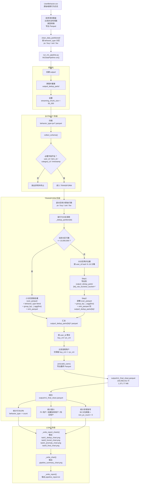
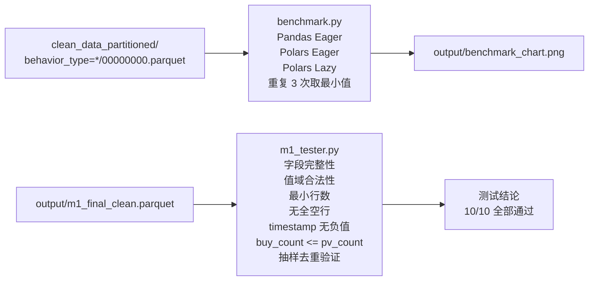

# M1 数据清洗与 ELT 工程化管道

## 项目概况

本项目为《大数据分析》课程 Milestone 1（M1）的工程化交付成果，目标是将阿里巴巴 UserBehavior 电商行为日志从原始 CSV 处理为可用于后续分析的高质量 Parquet 数据集，并形成可复现、可审计、可交付的工程化数据管道。

数据集包含四类核心行为：

- `pv`：浏览
- `fav`：收藏
- `cart`：加购
- `buy`：购买

本项目最终交付的核心产物为：

- `output/m1_final_clean.parquet`
- `output/pipeline_summary_chart.png`
- `output/benchmark_chart.png`
- `output/pipeline_report.txt`

当前真实产出结果如下：

| 项目 | 当前结果 |
|------|----------|
| 原始总行数 | 100,150,443 |
| 最终行数 | 100,058,431 |
| 移除重复行数 | 92,012 |
| 重复占比 | 0.0919% |
| 最终文件大小 | 1,371.77 MB |
| 最终 Schema | `user_id`、`item_id`、`timestamp`、`category_id`、`behavior_type` |

---

## 数据流转图

### 主数据流程：从 CSV 到最终交付



### 验证与性能对照流程



---

## 核心技术栈

| 技术 | 当前版本 | 用途 |
|------|----------|------|
| Python | 3.14.0 | 项目运行环境 |
| Polars | 1.38.1 | 主处理引擎，负责 Lazy API 与 streaming 计算 |
| PyArrow | 23.0.1 | Parquet 读写后端 |
| DuckDB | 1.5.0 | 前序阶段数据探查与 SQL 处理 |
| Pandas | 3.0.1 | 基准测试对照组 |
| Matplotlib | 3.10.8 | 图表绘制 |

---

## 工程结构

### M1DataPipeline 类职责

```text
M1DataPipeline
├── __init__(source_dir, output_dir)   # 初始化路径，清理临时目录
├── extract()                          # 验证输入分区 schema
├── _dedup_partition(bt)               # 单分区去重逻辑
├── transform()                        # 去重 + 统计 + 漏斗 + 异常检测
├── load(metrics)                      # 输出图表与文本报告
└── run()                              # 一键串联全流程
```

---

## 内存优化策略

处理 1 亿级行为日志时，内存控制是核心问题。本项目采用如下策略：

| 策略 | 说明 |
|------|------|
| PV 大分区分桶去重 | 对 `pv` 分区按 `user_id hash % 16` 分桶，再逐桶 streaming 去重，避免单次建立超大去重状态 |
| `group_by + agg(first)` 替代 `unique()` | 因 Polars streaming engine 对 `unique()` 支持有限，使用等价写法提高可执行性 |
| `engine="streaming"` | 大部分统计过程使用 streaming 模式，降低峰值内存 |
| `sink_parquet()` 中间落盘 | 先写中间结果，再基于最终输出做指标统计，减少重复 collect |
| 分区独立处理 | `buy/cart/fav` 小分区直接独立去重，避免不必要的复杂路径 |

---

## 核心分析指标

### 数据量与去重

| 指标 | 数值 |
|------|------|
| 原始总行数 | 100,150,443 |
| 去重后总行数 | 100,058,431 |
| 移除重复行数 | 92,012 |
| 重复占比 | 0.0919% |
| 最终文件大小 | 1,371.77 MB |

### 行为类型分布

这些数值直接来自最终 `m1_final_clean.parquet` 的真实统计结果：

| 行为类型 | 行数 | 占比 |
|----------|------|------|
| pv（浏览） | 89,711,368 | 89.66% |
| cart（加购） | 5,492,428 | 5.49% |
| fav（收藏） | 2,862,422 | 2.86% |
| buy（购买） | 1,992,213 | 1.99% |

### 用户行为转化漏斗

| 漏斗阶段 | 用户数 | 转化率（相对 PV） |
|----------|--------|-------------------|
| 浏览（PV） | 983,103 | 100.00% |
| 收藏 / 加购 | 855,631 | 87.03% |
| 购买 | 668,302 | 67.98% |
| 收藏/加购 → 购买 | - | 78.11% |

### 异常账号检测

检测逻辑：

- 用户访问量超过 99 分位阈值
- 且该用户不存在非 `pv` 行为

| 指标 | 数值 |
|------|------|
| 99 分位阈值（访问次数） | 409 |
| 全量用户数 | 983,892 |
| 嫌疑账号数 | 91 |
| 嫌疑账号占比 | 0.0092% |
| 嫌疑流量请求数 | 46,988 |
| 嫌疑流量占比 | 0.0470% |

---

## 数据交换测试（Data Swap Testing）

本项目使用教师提供的 `m1_tester.py` 对最终交付的 `m1_final_clean.parquet` 进行了黑盒校验。当前真实测试结果为：

- 文件存在且可访问：通过
- 文件可读取：通过
- 行数 > 0：通过
- 行数 >= 10,000,000：通过
- 必要字段完整：通过
- `behavior_type` 值域合法：通过
- 无全空行：通过
- `timestamp` 无负值：通过
- `buy_count <= pv_count`：通过
- 抽样去重验证：通过

最终结论：**10/10 项全部通过，数据质量符合 M1 基准要求。**

---

## 性能基准对比

`benchmark.py` 对 Pandas、Polars Eager、Polars Lazy 三种方案进行了对比，当前真实运行结果如下：

| 方案 | 耗时（秒） | 相对 Pandas 加速比 |
|------|------------|--------------------|
| Pandas Eager | 23.528 | 1.00x |
| Polars Eager | 2.045 | 11.51x |
| Polars Lazy | 0.539 | 43.67x |

可以看到，在该实验的数据规模下，Polars Lazy 相比 Pandas 具有明显性能优势，说明列式扫描与延迟执行非常适合大规模行为日志处理。

---

## AI 指令示例

以下提示词可用于让 AI 辅助生成本项目的技术文档：

```text
请根据我的 M1 管道代码，帮我写一份详细的技术文档。请用 Mermaid 或 PlantUML 语法画出数据流转图，并用表格列举出我识别出的核心业务指标，包括最终数据规模、转化漏斗百分比、异常账号比例、性能基准结果和数据交换测试结论。
```

---

## 输出文件说明

当前 `output/` 目录中与报告直接相关的真实文件包括：

| 文件 | 说明 |
|------|------|
| `m1_final_clean.parquet` | 最终交付的清洗结果 |
| `pipeline_report.txt` | 文本版执行报告 |
| `task1_dedup_chart.png` | 去重与行为分布图 |
| `task3_funnel_chart.png` | 漏斗分析图 |
| `task4_anomaly_chart.png` | 异常账号检测图 |
| `task5_final_chart.png` | 最终 KPI 总览图 |
| `pipeline_summary_chart.png` | 综合汇总图 |
| `benchmark_chart.png` | 性能基准图 |
| `checkself.png` | 黑盒测试通过截图 |

---

## 目录结构

```text
test4/
├── run_m1_pipeline.py
├── benchmark.py
├── m1_tester.py
├── README.md
├── requirements.txt
└── output/
    ├── m1_final_clean.parquet
    ├── pipeline_report.txt
    ├── task1_dedup_chart.png
    ├── task3_funnel_chart.png
    ├── task4_anomaly_chart.png
    ├── task5_final_chart.png
    ├── pipeline_summary_chart.png
    ├── benchmark_chart.png
    └── checkself.png
```

---

## 快速开始

### 安装依赖

```bash
pip install -r requirements.txt
```

### 运行主程序

```bash
python run_m1_pipeline.py
```

### 运行性能基准

```bash
python benchmark.py
```

### 运行黑盒测试

Windows PowerShell 下建议开启 UTF-8 输出，避免 `✅/❌` 字符编码报错：

```powershell
$env:PYTHONUTF8='1'
python m1_tester.py .\output\m1_final_clean.parquet
```

---

## 数据来源

阿里巴巴 UserBehavior 数据集。当前项目读取的是前序实验已经完成清洗和分区的 Parquet 数据，路径位于：

`../test2/clean_data_partitioned/`

数据按 `behavior_type` Hive 风格分区组织，便于在 M1 阶段进行分区扫描、独立去重和后续聚合分析。
