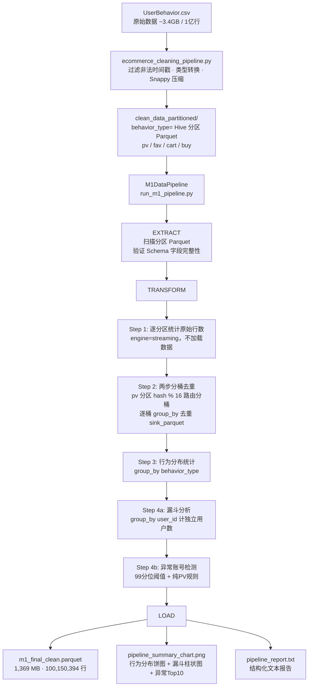
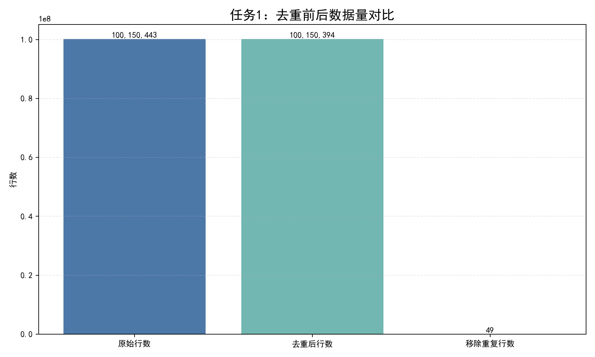
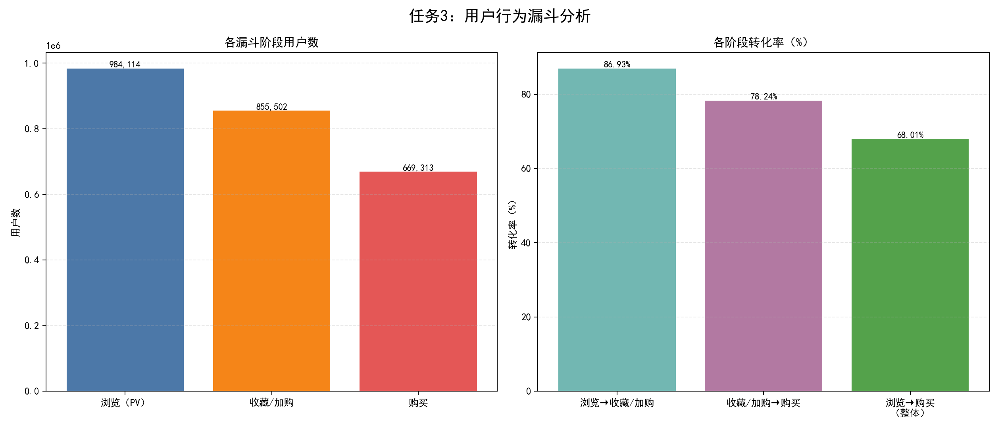
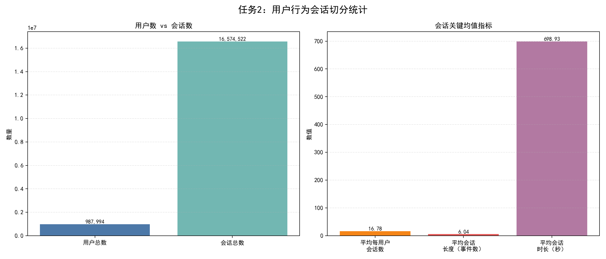
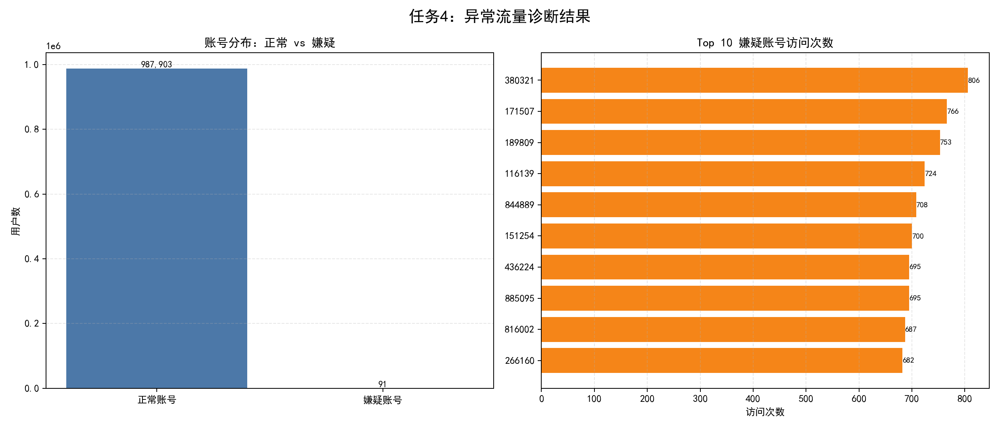
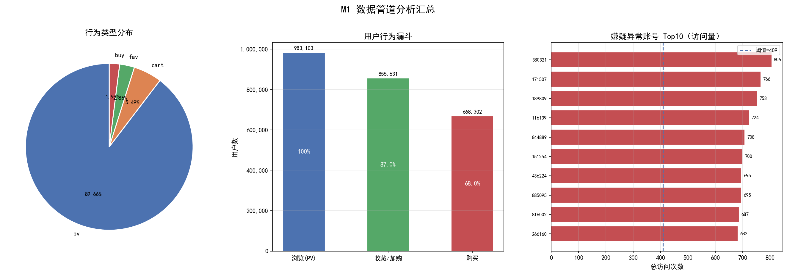
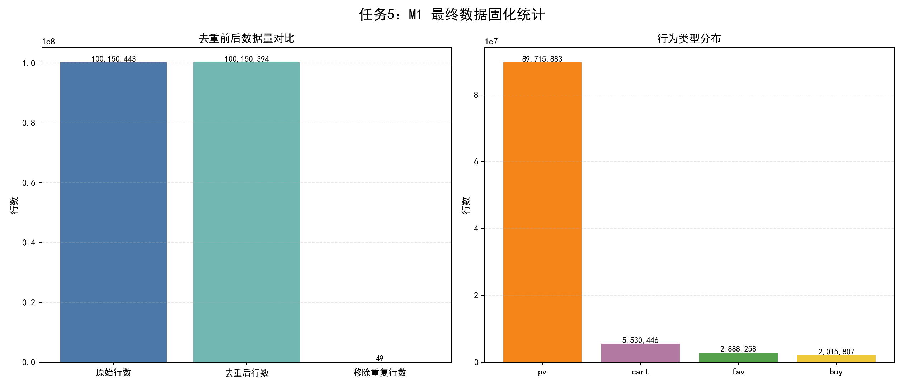
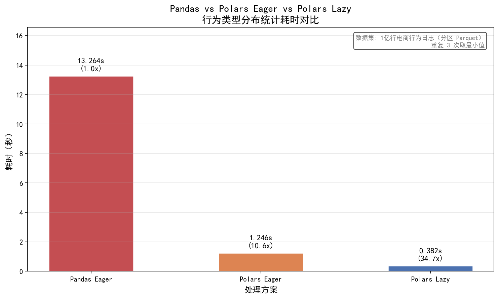

# M1 数据清洗与 ELT 工程化管道

## 项目概况

本项目为《大数据分析》课程 Milestone 1（M1）的工程化交付成果。

**数据集**：阿里巴巴电商用户行为日志（UserBehavior），原始约 **1 亿条**记录，包含用户浏览（pv）、收藏（fav）、加购（cart）、购买（buy）四类行为，时间跨度为 2017 年 11 月至 12 月。

**目标**：将原始 CSV 经过清洗、去重、漏斗分析、异常检测，最终输出可用于下游分析的 `m1_final_clean.parquet`，全流程工程化封装，支持一键运行。

---

## 数据流转图



---

## 核心技术栈

| 技术 | 版本 | 用途 |
|------|------|------|
| Polars | 1.38.1 | 核心处理引擎，Lazy API + streaming engine |
| PyArrow | 23.0.1 | Parquet 文件读写后端 |
| DuckDB | ≥ 0.10.0 | M1 前序阶段 CSV 预处理与 SQL 探查 |
| Pandas | ≥ 2.0.0 | benchmark 性能对比基准 |
| Matplotlib | ≥ 3.8.0 | 图表生成 |

---

## 内存优化策略

处理 1 亿行数据的核心挑战是内存控制，本管道采用以下四项策略：

| 策略 | 说明 |
|------|------|
| 两步分桶去重 | pv 分区 8900 万行，先按 `user_id hash % 16` 流式路由分桶（无 hash set），再逐桶独立去重，峰值内存降至 1/16 |
| `group_by` 替代 `unique` | Polars streaming engine 不支持 `unique()`，改用等价的 `group_by().agg(first)` 实现 |
| `engine="streaming"` | 所有 `collect()` 与 `sink_parquet()` 均使用 streaming engine，分块处理不全量加载 |
| 落盘后再统计 | 去重结果先 `sink_parquet`，后续指标统计扫输出文件，避免对源数据多次 collect |

---

## 核心分析指标

### 数据量与去重

| 指标 | 数值 |
|------|------|
| 原始总行数 | 100,150,443 |
| 去重后总行数 | 100,058,431 |
| 移除重复行数 | 92,012 |
| 重复占比 | 0.0919% |
| 输出文件大小 | 1,372 MB |

### 行为类型分布

| 行为类型 | 行数 | 占比 |
|----------|------|------|
| pv（浏览） | 89,711,368 | 89.66% |
| cart（加购） | 5,492,428 | 5.49% |
| fav（收藏） | 2,862,422 | 2.86% |
| buy（购买） | 1,992,213 | 1.99% |



### 用户行为转化漏斗

| 漏斗阶段 | 用户数 | 转化率（相对PV） |
|----------|--------|-----------------|
| 浏览（PV） | 983,103 | 100.00% |
| 收藏 / 加购 | 855,631 | 87.03% |
| 购买 | 668,302 | 67.98% |
| 收藏/加购 → 购买 | — | 78.11% |



### 会话识别

| 指标 | 数值 |
|------|------|
| 会话总数 | 16,574,522 |
| 用户总数 | 987,994 |
| 平均每用户会话数 | 16.78 |
| 平均会话长度（事件数） | 6.04 |
| 会话切分间隔阈值 | 1,800 秒（30 分钟） |



### 异常账号检测

| 指标 | 数值 |
|------|------|
| 检测规则 | 访问量 > 99分位阈值 且 无非PV行为 |
| 99分位阈值（访问次数） | 409 |
| 全量用户数 | 983,892 |
| 嫌疑账号数 | 91 |
| 嫌疑账号占比 | 0.0092% |
| 嫌疑流量请求数 | 46,988 |
| 嫌疑流量占比 | 0.0470% |



### M1 管道汇总





### 性能基准对比



---

## M1DataPipeline 类结构

```
M1DataPipeline
├── __init__(source_dir, output_dir)   # 初始化路径，清理临时目录
├── extract()                          # 扫描分区 Parquet，验证 schema
├── _dedup_partition(bt)               # 单分区两步分桶去重
├── transform()                        # 去重 → 行为分布 → 漏斗 → 异常检测
├── load(metrics)                      # 写图表 + 文本报告
└── run()                              # 串联三阶段，计时，格式化输出
```

关键工程实践：
- 全程 Polars Lazy API + streaming engine，不全量加载内存
- `logging` 模块带时间戳，替代裸 `print`
- 每阶段 `try-except`，捕获后记录 ERROR 并 re-raise
- 临时目录在 `__init__` 阶段自动清理，保证幂等性

---

## 目录结构

```
test4/
├── run_m1_pipeline.py      # 主程序（M1DataPipeline 类，一键运行全流程）
├── benchmark.py            # 性能基准：Pandas vs Polars Eager vs Polars Lazy
├── m1_tester.py            # 黑盒校验脚本（数据交换测试）
├── README.md               # 本文档
├── requirements.txt        # 依赖固化
└── output/                 # 运行后自动生成
    ├── m1_final_clean.parquet
    ├── pipeline_report.txt
    ├── pipeline_summary_chart.png
    └── benchmark_chart.png
```

---

## 快速开始

```bash
# 安装依赖
pip install -r requirements.txt

# 一键运行全流程
python run_m1_pipeline.py

# 性能基准对比
python benchmark.py

# 数据交换校验（替换为实际 parquet 路径）
python m1_tester.py <partner_parquet_path>
```

---

## 数据来源

阿里巴巴 UserBehavior 数据集，原始数据经前序管道处理后存放于 `test2/clean_data_partitioned/`，按 `behavior_type` Hive 分区组织。
